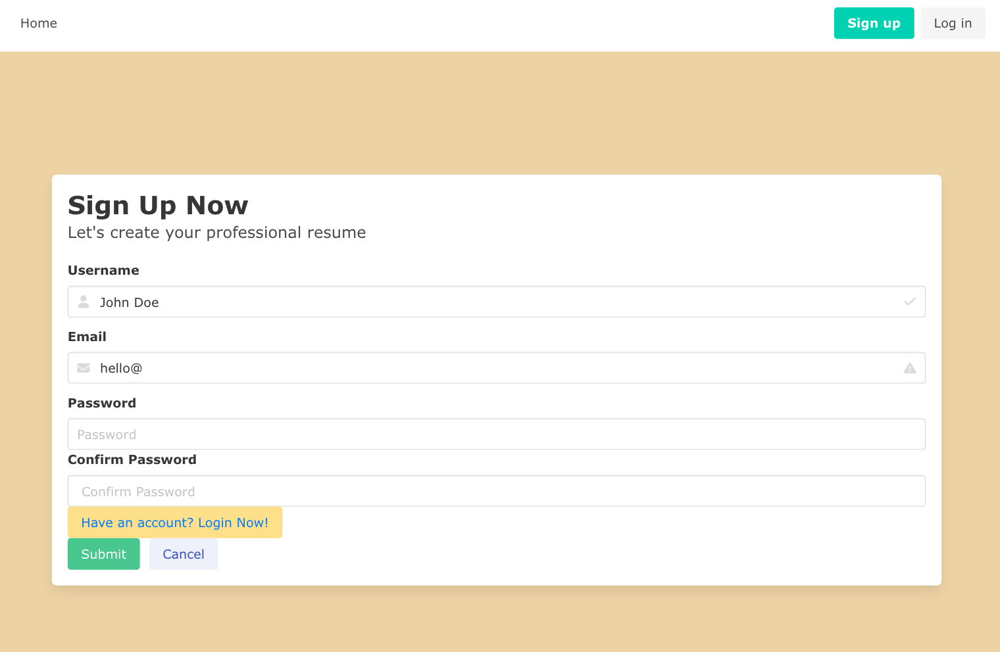
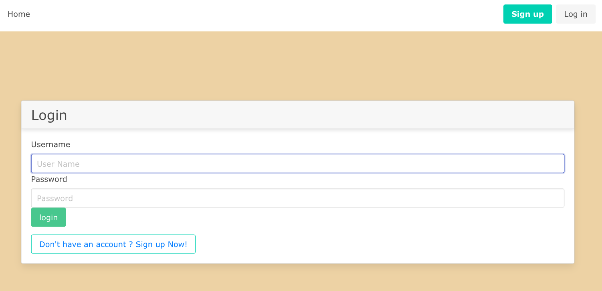
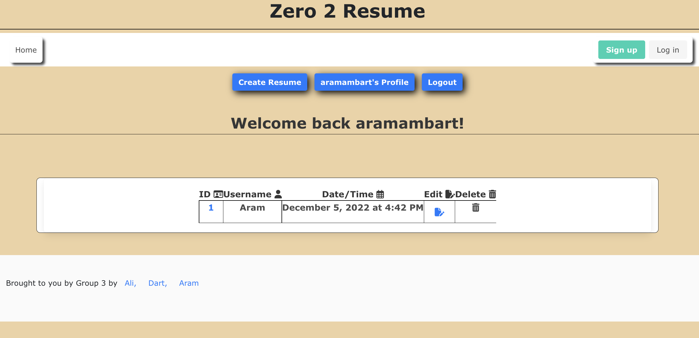
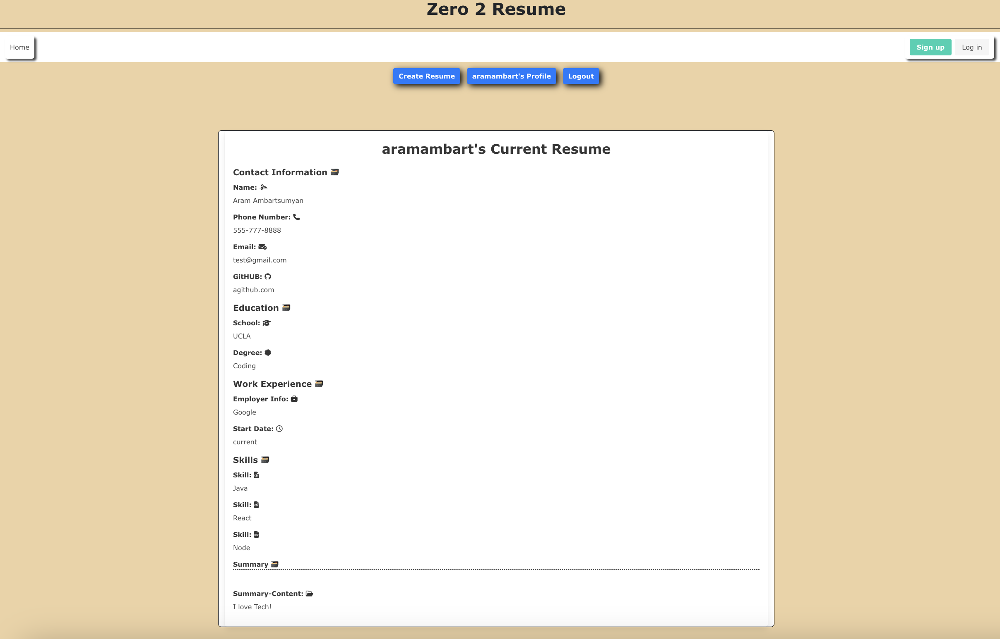

# Zero-2-Resume 

## Description

Zero 2 Resume is an application to help users create a professional resume. The user simply fills out the sections of the form and the application creates a resume template.

## Table Of Contents

* [Description](#description)
* [User Story](#user-story)
* [Installation](#installation)
* [Mock Up](#mock-up)
* [Heroku](#heroku)
* [GitHub Repository](#github-repository)

## User Story

As a user I want to be able to create a resume, without having the trouble of having to design it. With Zero 2 Resume I can simply choose a template and fill out the form. This makes the process extremley quick and simple.

## Installation

* Express/Handlebars
* Sequelize
* Bcrypt
* Mysql
* Bulma

## Mock Up

## Heroku

https://zero-2-resume.herokuapp.com/

## GitHub Repository

https://github.com/AramA89/Zero-2-Resume